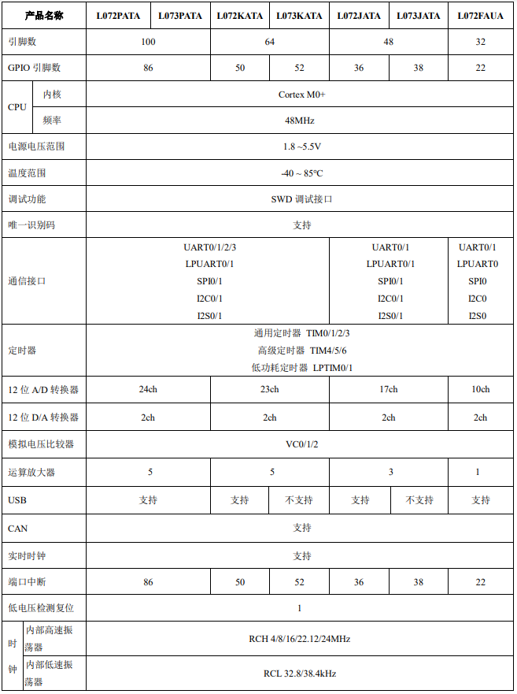

# [HC32L072](https://github.com/SoCXin/HC32L072)

* [hdsc](https://www.hdsc.com.cn/)：[Cortex-M0](https://github.com/SoCXin/Cortex)
* [L3R3](https://github.com/SoCXin/Level) ：48 MHz  * 0.95 DMIPS/MHz

## [简介](https://github.com/SoCXin/HC32L072/wiki)

[HC32L072](https://www.hdsc.com.cn/Category82_3) 款旨在延长便携式测量系统的电池使用寿命的超低功耗、宽电压工作范围的 MCU。内建 AES、TRNG 等信息安全模块，具有
高整合度、高抗干扰、高可靠性和超低功耗的特点。

#### 关键特性

* 2 x 12Bit 500Ksps DAC
* Crystal-less USB FS
* CAN2.0B
* 5 x OPA
* 3 x CMP
* 宽电压1.8-5.5V

#### 封装规格

* LQFP100（14*14mm,P0.5mm,H1.6mm）
* LQFP64（10*10mm,P0.5mm,H1.6mm）
* LQFP48（7*7mm,P0.5mm,H1.6mm）
* QFN32（5*5mm,P0.5mm,H.75mm）

### [资源收录](https://github.com/SoCXin)

* [参考文档](docs/)
* [参考资源](src/)
* [参考工程](project/)

### [选型建议](https://github.com/SoCXin)

[HC32L072](https://github.com/SoCXin/HC32L072)

### [探索芯世界 www.SoC.xin](http://www.SoC.Xin)
